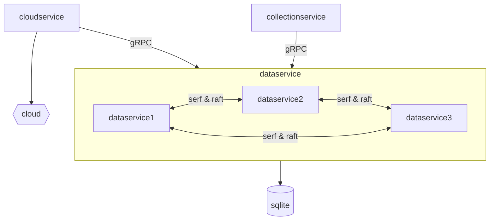

# REMS Controller Services

## A Toy Example of Application Services in Edge Controller for Residential EMS Controller

This simple edge controller consists of three microservices:

- **collectionservice**: Collect the data from power electricity devices, e.g., BMS.
- **dataservice**: Handle the persistence of collected data.
- **cloudservice**: Upload collected data to the cloud.

This project serves as an exercise example from [*Distributed Services with Go*](https://www.amazon.com/Distributed-Services-Go-Reliable-Maintainable/dp/1680507605). Some functionalities for distributed systems are intentionally applied and adapted from the book in these services. A brief coverage of features or functionalities is summarized below:

- gRPC server/client: Internal RPC communication mechanism between services.
- Authentication and authorization: Basic security configuration.
- gRPC middleware: For monitoring and auditing services.
- Serf and Raft: For the functionality of client-side discovery.
- gRPC-resolver and gRPC-loadbalancer: For advanced gRPC features.

> **NOTE**: As a simplistic example, only basic Raft features are integrated. Advanced features such as regular snapshot creation and efficient snapshot manipulation for new servers are not included. For a lightweight, distributed relational database with fully-fledged Raft features, [*rqlite*](https://github.com/rqlite/rqlite) may be referred to.

## Usage

### Compile Services

Compile or generate necessary files and executable binaries using the provided Makefile.

* Initialize preparations:
  - Run `make init`.
* Compile the protobufs:
  - Run `make genproto`.
* Generate certifications:
  - Run `make gencert`.
* Configure authorizations:
  - Run `make genacl`.
* Compile the services:
  - Run `make service`.

### Launch Services

Launch the services separately in any order.

* Launch the dataservice:
  - Run `./internal/service/dataservice/data_service`.
* Launch the collectionservice:
  - Run `./internal/service/collectionservice/collection_service`.
* Launch the cloudservice:
  - Run `./internal/service/cloudservice/cloud_service`.

## Overview

## Service

### collectionservice

This service serves as the simulation data source, collecting data from external power electricity devices at regular one-second intervals. It operates as a gRPC client, sending requests to the gRPC server (dataservice) every second to store the data. It implements server-client mutual authentication and basic authorization. Additionally, it features client-side discovery through the utilization of gRPC-resolver and gRPC-loadbalancer.

#### Demo Features

* gRPC client
* server-client mutual authentication and authorization
* client-side discovery with gRPC-resolver and gRPC-loadbalancer

### dataservice

The dataservice functions as the gRPC server, accepting requests from clients such as collectionservice and cloudservice to query or save data in the system. For simplicity, SQLite is chosen as the persisting datastore. To enhance reliability, the functionality of Serf and Raft are integrated into the service.

#### Demo Features

* gRPC server
* server-client mutual authentication & authorization
* Serf and Raft for enhanced reliability 

### cloudservice

The cloudservice, another gRPC client, queries collected data from the datastore and uploads it to the cloud at regular intervals. Similar to collectionservice, it enables server-client mutual authentication, basic authorization, and integrates client-side discovery. As the focus lies on the usage of gRPC features, the real logic of uploading data to the cloud is omitted for simplicity.

#### Demo Features

* gRPC client
* server-client mutual authentication and authorization
* client-side discovery with gRPC-resolver and gRPC-loadbalancer